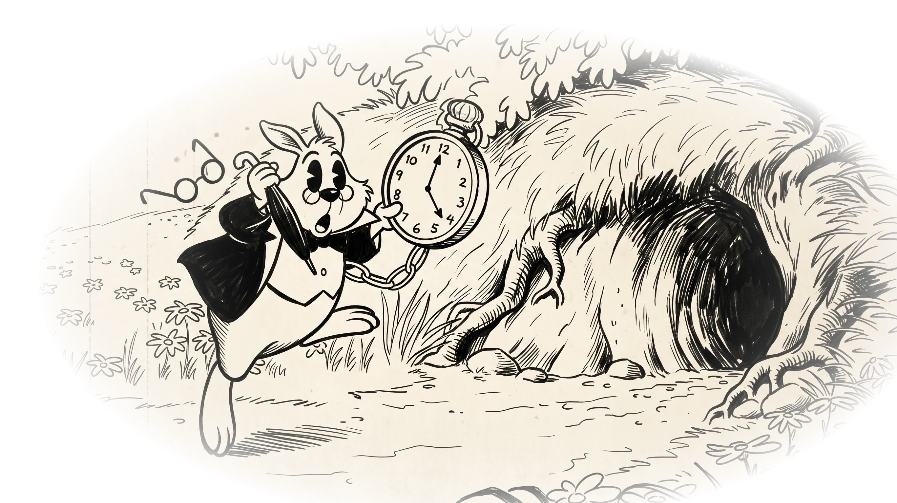
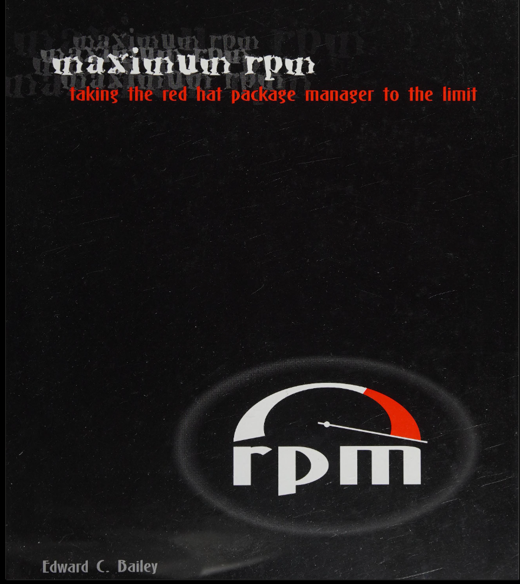

# Packathon

### Packaging e Distribuzione Software su Linux

<p class="text-muted" style="margin-top: 30px;">Linux Day Trieste 2026</p>

Note:
Lasciare ocio in esecuzione live su un secondo schermo o finestra divisa.
Gag di apertura:
"Gli organizzatori mi hanno invitato qui oggi per parlarvi di packaging e release engineering. Ma siamo onesti: io in realta' sono qui per mostrarvi la mia applicazione vibecodata in 15 minuti che vi cambiera' per sempre la vita."
Muovere il mouse, mostrare l'occhio che traccia il cursore, premere V per mostrare la versione (Ocio v0.1.0).
"Ora che l'avete vista, so che la volete tutti. Ma non ho un server o una pipeline di distribuzione. Quindi ho deciso di distribuirla alla vecchia maniera."
Estrarre il floppy disk fisico da 3.5" dalla borsa:
"Se a fine talk mi lasciate il vostro indirizzo postale e un francobollo, ve la spedisco per posta."
Il ritorno alla realta':
Cosa succede se carico questo binario grezzo compilato su un server web e dico a 50 sconosciuti di scaricarlo ed eseguirlo?
Fallisce immediatamente su macchine diverse: glibc disallineata, collegamenti dinamici DT_NEEDED mancanti (libGL.so, libX11.so), socket del display server assente o problemi di permessi.
La cavia: perche' questa app:
Sorgente volutamente banale: un solo main.c, ~280 righe di C99 pulito, zero logica di business: nulla compete con il packaging per l'attenzione.
Footprint di runtime massimamente realistico: richiede accelerazione hardware OpenGL via DRI, un display server attivo (X11 / Wayland) e IPC su memoria condivisa (MIT-SHM).
"Sorgente massimamente semplice, footprint di runtime massimamente realistico."

--

## Slides
<!-- .slide: class="text-center" -->

<div class="center-card">
  
  <p><a href="https://michelepagot.github.io/packathon/" target="_blank">michelepagot.github.io/packathon</a></p>
</div>

Note:
Pausa per consentire al pubblico di inquadrare il QR code e seguire live su smartphone o portatili.

--

## Speaker

* **Michele Pagot**
* **SUSE**: Quality Engineering (QE)
* GitHub: [`@michelepagot`](https://github.com/michelepagot) · [`@mpagot`](https://github.com/mpagot)

Note:
Breve presentazione del relatore.

--

## Disclaimer

* Non sono un package maintainer di professione.
* Lavoro in QE...

Note:
"Non sono un package maintainer di professione. Lavoro all'estremita' della pipeline: test, validazione e analisi degli output di rilascio su sistemi completi. Questo talk nasce come indagine ingegneristica per capire a fondo la catena che genera gli artefatti a monte prima che arrivino ai banchi di test."

--

## Agenda

<div class="grid-2">
<div>

1. **Censimento**
2. **Prospettive**
3. **Dipendenze**
4. **Formati**
5. **Delega**: RPM &amp; DEB *(Demo)*

</div>
<div>

6. **AppImage**, **Flatpak**, **Permessi**
7. **Rilascio** &amp; **Aggiornamenti**
8. **Firme** &amp; **SBOM**
9. **Sintesi**, **Metriche**, **Q&amp;A**

</div>
</div>

Note:
Panoramica sintetica della progressione del talk.

---

## Censimento

1. Chi usa Linux quotidianamente? <!-- .element: class="fragment" -->
2. Chi installa software esclusivamente tramite repository ufficiali? <!-- .element: class="fragment" --> <br><small class="text-muted">(APT, Zypper, DNF, Pacman, AUR... Emerge, Slackpkg, urpmi)</small>
3. Chi usa formati universali: Flatpak, AppImage o Snap? <!-- .element: class="fragment" -->
4. <!-- .element: class="fragment" --> `curl | sh`
5. Chi compila regolarmente da sorgenti? <!-- .element: class="fragment" --> <br><small class="text-muted">(<code>git clone &amp;&amp; cmake &amp;&amp; make &amp;&amp; sudo make install</code>)</small>

Note:
Scandire le 5 domande guardando la sala:
1. 100% mani alzate.
2. Repo ufficiali: cittadini modello con fiducia cieca nei maintainer.
3. Flatpak/AppImage: chi cerca novita' upstream o si e' arreso alla dependency hell.
4. curl | sh: pragmatismo notturno vs sicurezza della supply chain azzerata.
5. Compilazione: puristi di /usr/local.
Takeaway:
"Guardatevi intorno: in questa sala non esiste un solo modo in cui il software viene ricevuto su Linux. Ognuno opera con un modello di fiducia diverso, aspettative di aggiornamento diverse e compromessi operativi diversi."

--

## Prospettive

* <!-- .element: class="fragment" --> Utilizzatore
* <!-- .element: class="fragment" --> Sviluppatore
* <!-- .element: class="fragment" --> Maintainer

Note:
1. **L'Utilizzatore** (Vuole l'app, ma con esigenze opposte):
   - **Versioni:** Stabilità assoluta ("rocciosa") VS Novità day-zero.
   - **UX:** Installazioni e aggiornamenti senza attriti (zero configurazioni).
   - **Risorse:** Avvio istantaneo VS Risparmio di RAM/Disco.
   - **Portabilità:** Stessa esperienza garantita anche cambiando PC o distro.

2. **Lo Sviluppatore** (Vuole la massima diffusione):
   - **Focus:** Conosce la sua app a fondo, ma ignora i dettagli di 20 distro o hardware diversi.
   - **Asimmetria:** Controllo al 100% sul proprio codice, 0% sul sistema operativo dell'utente.
   - **Obiettivo:** "L'ho testato da me, deve funzionare senza sorprese da chi lo scarica".

3. **Il Maintainer / Distro Owner** (Vuole l'integrità del sistema):
   - **Focus:** Conosce l'OS e l'ecosistema (30k pacchetti), meno la singola app.
   - **Priorità:** Niente corruzioni, no conflitti ABI, patch di sicurezza centralizzate (es. CVE su OpenSSL).
   - **Filosofie:** Rolling release (Arch, Tumbleweed) VS Stabilità decennale (Debian, RHEL).

--

## Dipendenze

> *"Sul mio computer va"*

```text
/ocio: error while loading shared libraries: libOpenGL.so.0:
cannot open shared object file: No such file or directory
```
<!-- .element: class="fragment" -->

<div class="center-card fragment">
  
</div>

Note:
Chiedere al pubblico il codice di uscita: 127.

Comando di test in container minimale:
$ podman run --rm -v ./build/bin/ocio:/ocio:ro,Z registry.opensuse.org/opensuse/tumbleweed:latest /ocio

Mostra il frammento del coniglio:
"Benvenuti nella tana del bianconiglio delle dipendenze: avete compilato senza errori, ma a runtime fallisce immediatamente."

Aggancio scenico:
"Abbiamo compilato, messo il binario su una chiavetta o scaricato da GitHub, e lo lanciamo su una macchina pulita. Risultato immediato: errore a runtime.
Chi ha interrotto l'esecuzione? Il programma e' crashato? E' stato il kernel?
Guardiamo cosa succede realmente sotto il cofano all'avvio."

--

## Avvio

`$ ocio`

1. **Shell**: ricerca in `$PATH` &rarr; `/usr/bin/ocio` <small>(`command -v ocio`)</small>
2. **Kernel**: `execve()` &rarr; `PT_INTERP` &rarr; `ld.so`
3. **ld.so**: `DT_NEEDED` &rarr; `/lib64/libOpenGL.so.0` trovato
4. `main()`

Note:
Cosa accade realmente all'avvio:
"Quando viene eseguito un programma, l'esecuzione non inizia in main(). Il compito del sistema operativo è unicamente caricare il binario in memoria e passare il controllo a un componente in userspace: il dynamic linker (ld.so). È il linker dinamico che deve trovare e caricare tutte le librerie condivise richieste prima di avviare il nostro codice C. Se manca anche una sola libreria, ld.so termina il processo immediatamente con codice di uscita 127. Il kernel non ha fallito e il nostro codice non è crashato: semplicemente non ha mai avuto la possibilità di eseguire una sola istruzione."

Sotto il cofano:
1. Shell: individua `/usr/bin/ocio` tramite `$PATH` (`command -v ocio`).
2. Kernel: `execve()` mappa l'ELF e legge `PT_INTERP` (la stringa `/lib64/ld-linux-x86-64.so.2` dalla sezione `.interp`). Allestisce lo stack iniziale, scrive l'Auxiliary Vector (auxv: AT_PHDR, AT_ENTRY, AT_BASE) e punta RIP direttamente a `ld.so`. Il kernel ha completato il suo compito con successo (codice 0)!
   (Contrasto: se il percorso dell'interprete non esistesse sul disco, execve fallirebbe subito nel kernel con ENOENT: "cannot execute: required file not found").
3. Dynamic Linker (`ld.so` in userspace): scansiona `DT_NEEDED` nell'ordine di ricerca (RPATH -> LD_LIBRARY_PATH -> RUNPATH -> /etc/ld.so.cache -> /lib64). Non trovando `libOpenGL.so.0` dopo i vari tentativi `openat()`, stampa l'errore e invoca la syscall `exit_group(127)`.
4. `main()`: non viene mai raggiunto.

Comando da mostrare:
`readelf -p .interp ./ocio` (mostra il percorso del dynamic linker incorporato nell'ELF)

Ponte verso la slide successiva:
"Andiamo a ispezionare direttamente il binario per capire cosa stava cercando il dynamic linker."
"Il kernel valida l'array di 16 byte e_ident (\x7fELF). Teniamo a mente questi 16 byte: vedremo nel Capitolo 5 come AppImage riutilizza lo spazio di padding inutilizzato alla fine dell'header."


**Cosa accade realmente (Il mito del main):**
- L'esecuzione *non* inizia in `main()`.
- Il Kernel carica il binario e cede il controllo a `ld.so` (userspace). Se manca una libreria, `ld.so` blocca tutto subito (exit 127).

**Sotto il cofano (Passo per Passo):**
1. **Shell**: Trova l'eseguibile via `$PATH`.
2. **Kernel (`execve`)**:
   - Mappa l'ELF, legge `PT_INTERP` (es. `/lib64/ld-linux-x86-64.so.2`).
   - Prepara stack e Auxiliary Vector.
   - **Cruciale:** Passa il controllo (RIP) a `ld.so` (successo per il Kernel).
   - *(Se manca l'interprete: `execve` fallisce subito con ENOENT).*
3. **Dynamic Linker (`ld.so`)**:
   - Legge `DT_NEEDED`.
   - Cerca le librerie (ordine: RPATH -> LD_LIBRARY_PATH -> Cache -> /lib64).
   - Non trova `libOpenGL.so.0` &rarr; stampa errore &rarr; `exit_group(127)`.
4. **`main()`**: Mai raggiunto.

**Comando (Live/Demo):**
- `$ readelf -p .interp ./ocio` (Mostra il dynamic linker hardcoded nell'ELF).

**Ponte (Verso la prossima slide):**
- "Ispezioniamo il binario: cosa cercava il linker?"
- **Foreshadowing (AppImage):** Il kernel valida l'header ELF (`\x7fELF`). Nel Capitolo 5 vedremo come AppImage sfrutta il padding libero in questo header.


--

## Seguendo libOpenGL.so.0

```text
$ readelf -d ocio | grep NEEDED
 (NEEDED)  Shared library: [libm.so.6]
 (NEEDED)  Shared library: [libOpenGL.so.0]
 (NEEDED)  Shared library: [libGLX.so.0]
 (NEEDED)  Shared library: [libc.so.6]
```

```text
$ ldd ./ocio
    linux-vdso.so.1 (0x00007ffe315f6000)
    libm.so.6 => /lib64/libm.so.6 (0x00007f9c8f2b0000)
    libOpenGL.so.0 => not found
    libGLX.so.0 => not found
    libc.so.6 => /lib64/libc.so.6 (0x00007f9c8f0b0000)
    /lib64/ld-linux-x86-64.so.2 (0x00007f9c8f3b0000)
```
<!-- .element: class="fragment" -->

Note:
Requisiti dichiarati vs. Realta' dell'host:
"Come diagnostichiamo cosa e' andato storto?
`readelf -d` ispeziona il file binario stesso per vedere quali dipendenze sono state registrate durante la compilazione.
`ldd` chiede al dynamic linker di simulare la risoluzione di tali dipendenze sul sistema host corrente.
Sulla macchina di sviluppo le librerie erano presenti nella cache locale. Sulla macchina di test mancano, quindi ldd segnala 'not found'."

Sotto il cofano:
1. `readelf -d` legge direttamente la sezione `.dynamic`: `DT_NEEDED` elenca le dipendenze dinamiche registrate dal linker. Notate che Raylib non compare perché nella build predefinita è incorporata staticamente in `.text`. Ma il backend GLFW di Raylib richiede `libOpenGL.so.0` e `libGLX.so.0` (architettura libglvnd, non la vecchia libGL).
2. `ldd` è uno script che esegue `ld.so` con `LD_TRACE_LOADED_OBJECTS=1`. Cerca nei percorsi di sistema dell'host e in `/etc/ld.so.cache`.
   Risultato: `libOpenGL.so.0` e `libGLX.so.0` risultano "not found".

Comandi da mostrare:
`readelf -d ./ocio | grep NEEDED` (l'elenco delle dipendenze a tempo di compilazione)
`ldd ./ocio` (la verifica della risoluzione sull'host)

Ponte verso la slide successiva:
"Ma come e' possibile? Sul computer di sviluppo compilava senza warning ed eseguiva perfettamente. Come fa un compilatore a produrre un binario che muore prima ancora di entrare in main()?"

--

## Build vs. Runtime

<div class="grid-2">
<div>

### Build-Time
* Consumate **una volta**
* Header &amp; librerie statiche
* Compilatore &amp; tool

</div>
<div>

### Runtime
* Richieste **a ogni avvio**
* `.so` dinamiche &amp; `glibc`
* Display &amp; nodi GPU

</div>
</div>

<p class="fragment text-info" style="margin-top: 35px;">
<em>In C, un binario dinamico è un contratto incompleto con l'OS host.</em>
</p>

Note:
Il contratto a tempo di compilazione vs esecuzione:
"Perché il binario ha compilato senza errori se poi non può essere eseguito?
A tempo di compilazione (build-time), al compilatore servono solo i file header (.h) per validare le firme delle funzioni e gli stub dei simboli per calcolare gli offset di rilocazione. Non verifica affatto che librerie condivise funzionanti saranno presenti sull'host di destinazione.
A tempo di esecuzione (runtime), il binario richiede le librerie condivise concrete (.so), un display server attivo (X11 o Wayland) e i moduli driver GPU hardware."

Perché non compiliamo tutto staticamente al 100% (`gcc -static`) come fanno Go o Rust?
- Abbiamo fatto esattamente questo esperimento (Variante 7): il linker GNU ld fallisce subito con: `attempted static link of dynamic object '/usr/lib64/libOpenGL.so'`.
- Nelle distribuzioni Linux `libglvnd` non fornisce archivi statici `.a`.
- Ancora più a monte: i driver GPU desktop su Linux sono caricatori dinamici. I driver DRI (Mesa: `iris_dri.so`, `radeonsi_dri.so`, `nvidia.so`) devono essere rilevati e caricati dinamicamente via `dlopen()` a runtime in base alla specifica scheda video installata nel computer.
- Inoltre, una glibc statica rompe i plugin dinamici NSS (`/etc/nsswitch.conf`).
- Morale: un'applicazione grafica desktop su Linux non può essere al 100% statica. In C, un binario dinamico è un contratto incompleto che deve essere onorato dall'OS host.

Comando da mostrare:
`gmake -C build-07-attempt-static 2>&1 | grep "attempted static link"` (dimostra che ld rifiuta OpenGL statico)

Ponte verso la sezione Formati:
"Il binario richiede queste librerie, ma il sistema dell'utente non le possiede. Come facciamo a distribuirle o a garantire che siano presenti?
E' qui che entra in gioco il packaging: ciascun formato su Linux adotta una strategia radicalmente diversa per colmare questo divario."

---

## Formati

| Target | Meccanismo |
|---|---|
| **Standalone Tarball** | Archivio compresso (`.tar.gz`) con asset e `.desktop` |
| **RPM (`.rpm`)** | Payload CPIO per Fedora/openSUSE/RHEL |
| **Debian (`.deb`)** | Archivio `ar` standard via CPack |
| **AppImage** | File unico con SquashFS montato via FUSE |
| **Flatpak** | Sandbox Bubblewrap su runtime Freedesktop |

Note:
Lo spettro dei formati esplorati: dal semplice tarball non gestito ai pacchetti di sistema, bundle auto-montanti e sandbox desktop.
Regola di conteggio: non citare mai il numero totale dei formati a voce (le liste differiscono intenzionalmente tra le sezioni).
Transizione verso la Rotta 1: approfondiremo i 4 grandi formati desktop (RPM, DEB, AppImage, Flatpak), partendo dalla delega alla distribuzione.

---

## RPM: Standard Nativo

<div class="grid-2" style="align-items: center; gap: 40px; margin-top: 30px;">
<div style="flex: 0 0 auto;">
  
</div>
<div style="flex: 1; font-size: 1.05em; line-height: 1.8;">

* *Marc Ewing &amp; Erik Troan* (Red Hat, 1997)
* Archivio con metadati di dipendenza
* Standard enterprise e distro (LSB)

</div>
</div>

Note:
Introduciamo RPM:
- Origine: Creato nel 1997 da Marc Ewing ed Erik Troan (Red Hat).
- Natura: Un archivio con metadati che trasporta file e dichiara dipendenze formali.
- Diffusione: Lo standard di riferimento per openSUSE, SLE, Fedora e RHEL (specifica LSB).
- CLI quotidiana:
  * Ispezione: rpm -qlp (file) e rpm -qp --requires (dipendenze)
  * Installazione con gestore pacchetti: zypper in oppure dnf in
  * Verifica integrita': rpm -V (rileva file alterati rispetto ai digest del db)
Ora andiamo a vedere cosa c'e' fisicamente dentro il file .rpm sul disco.

--

## Dentro un RPM: Struttura

```text
$ file ocio-0.1.0-1.x86_64.rpm
ocio-0.1.0-1.x86_64.rpm: RPM v3.0 bin i386/x86_64
```
<!-- .element: class="fragment" -->

| Lead | Signature | Header | Payload |
|:---:|:---:|:---:|:---:|
| `magic` | `digests, GPG` | `name, deps, files` | `cpio (zstd)` |

<!-- .element: class="fragment" -->

```text
$ xxd -l 96 -d ocio-0.1.0-1.x86_64.rpm
0000: edab eedb 0300 0000 0001 6f63 696f 2d30  ..........ocio-0
0016: 2e31 2e30 2d31 0000 0000 0000 0000 0000  .1.0-1..........
0032: 0000 0000 0000 0000 0000 0000 0000 0000  ................
0048: 0000 0000 0000 0000 0000 0000 0000 0000  ................
0064: 0000 0000 0000 0000 0000 0000 0001 0005  ................
0080: 0000 0000 0000 0000 0000 0000 0000 0000  ................
```
<!-- .element: class="fragment" style="font-size: 0.48em; line-height: 1.2;" -->

Note:
file identifica il formato dai byte magici (ed ab ee db): "RPM v3.0" e' il formato lead legacy, ancora scritto da rpm moderno per compatibilita'.
xxd mostra i primi 96 byte del Lead fisso:
- Byte magici ed ab ee db (offset 0..3)
- Versione 3.0 (4..5) e tipo pacchetto binario (6..7)
- Nome pacchetto "ocio-0.1.0-1" in ASCII (10..22)
- Tipo di signature header-style (00 05 a offset 78)
Anatomia del file:
- Lead: blocco fisso legacy di 96 byte, oggi quasi solo un magic number.
- Signature: digest di header e payload, piu' la firma GPG quando presente (il nostro non ne ha).
- Header: tutti i metadati che interroghiamo con rpm -q (nome, versione, Requires, Provides, elenco file con digest).
- Payload: i file effettivi, in un archivio cpio compresso con zstd (rpm -qp --qf '%{PAYLOADFORMAT} %{PAYLOADCOMPRESSOR}' stampa "cpio zstd").

--

## Dentro un RPM: Estrazione

```text
$ rpm2cpio ocio-0.1.0-1.x86_64.rpm | file -
/dev/stdin: ASCII cpio archive (SVR4 with no CRC)
```

```text
$ rpm2cpio ocio-0.1.0-1.x86_64.rpm | cpio -idmv
./usr/bin/ocio
./usr/share/applications/ocio.desktop
...
```
<!-- .element: class="fragment" -->

Note:
Cos'e' cpio:
- Formato di archivio Unix degli anni '70 ("copy in / copy out"), stessa idea di tar: una sequenza lineare di record (header + dati file).
- Nessuna compressione e nessun indice interno; la compressione viene applicata sopra (qui zstd).
- Variante SVR4 "newc": header ASCII, magic "070701". Il kernel Linux usa lo stesso formato per l'initramfs.
Come estrarlo:
- rpm2cpio rimuove lead, signature e header, decomprime il payload e scrive il flusso cpio su stdout.
- cpio -i estrae, -d crea le directory, -m preserva i timestamp di modifica, -v elenca i file.
- I percorsi sono relativi (./usr/...): tutto finisce nella directory corrente, il sistema non viene toccato.
- Scorciatoia: bsdtar -tf / -xf legge direttamente i file RPM.
- L'eseguibile estratto ./usr/bin/ocio e' identico byte per byte al binario compilato.
Messaggio chiave: estrarre significa solo copiare file. Nessun controllo di dipendenze, nessun record nel database, nessuno script. L'installazione e' cio' che rpm aggiunge sopra: tenetelo a mente per le prossime slide.

--

## Dentro un RPM: Payload

```text
$ rpm -qlp ocio-0.1.0-1.x86_64.rpm
/usr/bin/ocio
/usr/share/applications/ocio.desktop
/usr/share/icons/hicolor/256x256/apps/ocio.png
/usr/share/icons/hicolor/scalable/apps/ocio.svg
/usr/share/metainfo/org.packathon.ocio.metainfo.xml
```

Note:
rpm puo' interrogare il file senza installarlo (-p = file di pacchetto).
Dettaglio del payload (directory omesse dall'elenco):
- /usr/bin/ocio: il binario, posizionato in una directory gia' presente nel $PATH di sistema.
- .desktop + icone: desktop entry e icone per consentire al desktop environment di mostrarlo nei menu.
- metainfo XML: metadati AppStream affinche' i software center grafici (GNOME Software, Discover) presentino descrizioni, categorie e screenshot.

--

## Dentro un RPM: Metadati

```text
$ rpm -qp --requires ocio-0.1.0-1.x86_64.rpm
libOpenGL.so.0()(64bit)
libGLX.so.0()(64bit)
libc.so.6(GLIBC_2.34)(64bit)
libm.so.6(GLIBC_2.43)(64bit)
...
```

```text
$ rpm -qp --provides ocio-0.1.0-1.x86_64.rpm
ocio = 0.1.0-1
application(ocio.desktop)
```
<!-- .element: class="fragment" -->

Note:
Ispezione dell'header:
- Guardate i Requires: libOpenGL.so.0, libGLX.so.0. Questo e' esattamente l'elenco DT_NEEDED del crash iniziale.
- Nessuno ha scritto queste righe a mano: il dependency generator di rpmbuild scansiona il binario ELF (DT_NEEDED + versioni simboli glibc) e compila l'header in automatico.
- Provides: cosa offre questo pacchetto al sistema (nome pacchetto, versione e capacita' desktop).
- Parcheggiamo GLIBC_2.43: notate questa baseline di simboli; ci torneremo analizzando i trade-off della delega.

--

## Cucinare un RPM

* **Tool**: `rpmbuild` (da `rpm-build`)
* **Ricetta**: Il file `.spec` (`ocio.spec`)
* **Albero**: `SOURCES/`, `SPECS/`, `BUILD/`, `BUILDROOT/`, `RPMS/`, `SRPMS/`
* **Flusso**: `rpmbuild -ba ocio.spec`

Note:
Come si costruisce un RPM nativo:
- Per costruire un RPM nativo servono l'archivio sorgente in SOURCES/ e la ricetta in SPECS/.
- Eseguendo `rpmbuild -ba ocio.spec` legge la ricetta in SPECS/ e il tarball in SOURCES/.
- Esegue prep, build, installazione simulata in una directory di staging (BUILDROOT) e genera sia il pacchetto binario (.rpm) che il pacchetto sorgente (.src.rpm).
- Il package manager non compila il software; rpmbuild e' il tool dedicato per la creazione dei pacchetti.

--

## Dentro il .spec: Sezioni

* **Preambolo**: `Name`, `Version`, `Release`, `License`, `Source0`
* **`%prep`**: Scompattamento sorgenti e applicazione patch (`%autosetup`)
* **`%build`**: Compilazione applicazione (`%cmake`, `%cmake_build`)
* **`%install`**: Staging dei file nella directory `BUILDROOT` (`%cmake_install`)
* **`%files`**: Elenco dei file impacchettati nel payload CPIO

Note:
La struttura di uno spec file:
- Preambolo: Metadati del pacchetto, licenza, URL e archivi sorgenti.
- %prep: Prepara l'albero di build, solitamente scompattando i tarball con %autosetup.
- %build: Invoca il sistema di build tramite macro di distro (%cmake e %cmake_build).
- %install: Installa gli artefatti in una root temporanea pulita (BUILDROOT) che replica il filesystem di destinazione.
- %files: Manifest esplicito dei file presenti in BUILDROOT da includere nel payload RPM. Qualsiasi file non tracciato provoca un errore di build.

--

## Spec: Dipendenze

* **`BuildRequires`**: Contratto esplicito per tool e header
* **Chroot puliti**: Dipendenza mancante &rarr; build fallita subito
* **Grafo ermetico**: Rete disabilitata (OBS / Koji), riproducibile

Note:
Gestione delle dipendenze a build-time:
- Il packager dichiara BuildRequires in modo esplicito per tutti i compilatori, i tool e gli header di sviluppo (-devel, come gcc, cmake >= 3.16, pkgconfig, raylib-devel, Mesa-libGL-devel).
- Nei buildroot puliti (OBS, Koji o mock), la connessione di rete e' disabilitata. Se una dipendenza non e' indicata in BuildRequires, la compilazione si interrompe all'istante.
- Questo garantisce un grafo delle dipendenze strettamente verificabile e riproducibile.

--

## Spec: Dipendenze a Runtime

* **`find-requires`**: Scansione automatica dei binari in `BUILDROOT`
* **`DT_NEEDED`**: Collegamento dinamico &rarr; rilevato in automatico
* **`dlopen()`**: Caricamento a runtime &rarr; invisibile allo scanner
* **Contratto generato**: Traduce simboli e `DT_NEEDED` &rarr; `Requires:`

Note:
Gestione delle dipendenze a runtime:
- Nessuno scrive a mano Requires: libc.so.6 nel file spec.
- Dopo %install, rpmbuild esegue lo script interno find-requires su tutti i binari ELF in BUILDROOT.
- La dualita' a runtime:
  1. Le librerie collegate normalmente sono registrate in DT_NEEDED: find-requires le legge in automatico ed emette i requisiti del pacchetto insieme alle versioni dei simboli glibc.
  2. Le librerie caricate a runtime tramite dlopen() e puntatori a funzione: invisibili a find-requires perche' non compaiono nella sezione dinamica ELF.

--

## CPack

* Packaging integrato in CMake: nessun file `.spec` manuale
* Configurazione minima in `CMakeLists.txt`:

```cmake
set(CPACK_GENERATOR "TGZ;DEB;RPM")
set(CPACK_RPM_PACKAGE_AUTOREQPROV ON)
include(CPack)
```

* Comando: `cpack -G RPM`

Note:
Il flusso con CPack:
- Per uno sviluppatore che usa CMake, CPack permette di creare pacchetti RPM senza scrivere a mano un file .spec.
- Bastano poche righe in CMakeLists.txt e lanciare `cpack -G RPM` per ottenere il pacchetto.
- Genera lo spec internamente e invoca rpmbuild.
- La build CMake standard conserva DT_NEEDED -> find-requires rileva libOpenGL.so.0 -> si installa e funziona subito ("funziona e basta!").

--

## La Trappola di --as-needed

* <!-- .element: class="fragment" --> Hardening di distro: `%cmake` inietta `-Wl,--as-needed` di default
* <!-- .element: class="fragment" --> Pruning del linker e punto cieco di `dlopen()`: Raylib invoca OpenGL via puntatori &rarr; `DT_NEEDED` rimosso, `find-requires` non lo vede
* <!-- .element: class="fragment" --> Fallimento silenzioso: installa 1 pacchetto (904 KiB) invece di 36 (53 MiB) &rarr; crash a runtime

```rpm
# In ocio.spec: bridging the dlopen() blind spot
Requires: libOpenGL.so.0()(64bit)
Requires: libGLX.so.0()(64bit)
```
<!-- .element: class="fragment" -->

Note:
La trappola per chi scrive lo spec:
- Con CPack tutto "funzionava e basta".
- Ma quando l'autore scrive ocio.spec per le distribuzioni ufficiali usando macro come %cmake, la toolchain di distro inietta flag di hardening, in particolare -Wl,--as-needed.
- Poiche' Raylib risolve i punti di ingresso OpenGL dinamicamente tramite puntatori e dlopen(), GNU ld con --as-needed considera il link non necessario e rimuove libOpenGL.so.0 e libGLX.so.0 da DT_NEEDED.
- find-requires scansiona unicamente DT_NEEDED: non trova dipendenze grafiche ed emette solo libc e libm.
- L'RPM compila senza errori, ma Zypper installa solo 1 pacchetto (904 KiB) invece di 36 (53 MiB). Il programma si avvia, ma va in crash all'apertura della finestra!
- La soluzione: l'autore deve colmare manualmente il punto cieco di dlopen() dichiarando le capability virtuali in ocio.spec tramite Requires:.

--

## Dopo l'Installazione: Risolto

```text
$ ldd /usr/bin/ocio
  libm.so.6 => /lib64/libm.so.6
  libOpenGL.so.0 => /lib64/libOpenGL.so.0
  libGLX.so.0 => /lib64/libGLX.so.0
  libc.so.6 => /lib64/libc.so.6
  libGLdispatch.so.0 => /lib64/libGLdispatch.so.0
  libX11.so.6 => /lib64/libX11.so.6
  libxcb.so.1 => /lib64/libxcb.so.1
  ...
```

<p class="fragment text-info" style="margin-top: 25px;">
<strong>486 KB</strong> di pacchetto &rarr; <strong>36</strong> pacchetti &rarr; <strong>52.6 MiB</strong> di download
</p>

Note:
Confronto diretto con il crash iniziale:
- Ogni libreria prima mancante (libOpenGL.so.0, libGLX.so.0) e' ora risolta con un percorso assoluto in /lib64.
- Notate la risoluzione transitiva: il loader ha risolto anche le dipendenze secondarie tirate dentro da libglvnd (libGLdispatch, libX11, libxcb).
- Il costo della delega: per installare il nostro pacchetto da 486 KB, il SAT solver (libsolv) ha selezionato 36 pacchetti dal repository per un totale di 52.6 MiB di download.
- Il contratto userspace e' ora completamente soddisfatto dalla distribuzione.

--

## Come 1 è Diventato 36: libsolv

* <!-- .element: class="fragment" --> Contratto locale: contratto di capability &rarr; `libOpenGL.so.0()(64bit)` (auto-estratta o dichiarata)
* <!-- .element: class="fragment" --> Grafo del repository: 30.000+ pacchetti con capability virtuali, versioni e conflitti
* <!-- .element: class="fragment" --> Motore di risoluzione: `zypper` / `dnf` delega a `libsolv`
* <!-- .element: class="fragment" --> SAT Booleano: traduce i vincoli in clausole CNF &rarr; calcola la chiusura transitiva in ms

Note:
Perche' l'installazione del nostro singolo RPM ha tirato dentro altri 35 pacchetti?
- Che sia auto-estratta da find-requires (build CPack) o dichiarata dal maintainer nel .spec per superare --as-needed, il contratto richiede libOpenGL.so.0()(64bit).
- Le capability astratte (SONAME) disaccoppiano il binario dai nomi fisici dei pacchetti: qualsiasi pacchetto che fornisce libOpenGL.so.0()(64bit) (come libglvnd) soddisfa il contratto.
- Il comando rpm a basso livello non puo' risolvere la rete: rpm -i fallirebbe con dipendenza mancante.
- I frontend (Zypper / DNF) passano il catalogo del repository a libsolv, che interroga l'indice whatprovides.
- libsolv traduce requisiti e conflitti in clausole booleane in forma normale congiuntiva (CNF) (es. A richiede B -> NOT A OR B).
- In pochi millisecondi, il solver SAT (CDCL) calcola una chiusura consistente: sul nostro container minimale privo di stack grafico, soddisfare libglvnd porta a cascata Mesa, X11 e librerie DRM, totalizzando esattamente 36 pacchetti.

--

## Dopo l'Installazione: Registrato e Protetto

```text
$ rpm -qf /usr/lib64/libOpenGL.so.0
libglvnd-1.7.0-2.4.x86_64
```

```text
$ rpm -V ocio && echo clean
clean
```
<!-- .element: class="fragment" -->

```text
$ rpm -e --test libglvnd
error: Failed dependencies:
  libOpenGL.so.0()(64bit) is needed by (installed) ocio-0.1.0-1.x86_64
```
<!-- .element: class="fragment" -->

Note:
Installare significa copiare file e mantenere un database autorevole:
- Proprieta' (rpm -qf): ogni singolo file sul filesystem ha un pacchetto proprietario certo e tracciabile.
- Verifica integrita' (rpm -V): verifica i file rispetto ai digest sha256 memorizzati. Se un file viene manomesso, rpm -V lo segnala all'istante.
- Protezione dipendenze (rpm -e --test): il sistema impedisce la rimozione accidentale di librerie necessarie ad altri pacchetti installati.

--

## DEB: Standard Debian

* *Ian Murdock* (Debian, 1993)
* Rigide policy e conformità FHS
* Standard Debian, Ubuntu e Mint

<p class="fragment text-info" style="margin-top: 35px;">
<strong>Superpotere:</strong> Mappatura esatta dei simboli via <code>dpkg-shlibdeps</code> e scriptlet di controllo.
</p>

Note:
Introduciamo DEB:
- Origine: Creato nel 1993 da Ian Murdock per la release iniziale di Debian.
- Natura: Formato vincolato da rigide policy di packaging della distribuzione e conformita' FHS.
- Diffusione: Lo standard di riferimento per Debian, Ubuntu, Linux Mint e derivate.
- CLI quotidiana:
  * Ispezione: dpkg-deb -c (file) e dpkg-deb -I (metadati di controllo)
  * Installazione con risolutore: apt install ./file.deb
  * Verifica integrita': debsums (verifica integrita' file rispetto ai checksum md5)
- Superpotere: Mappatura esatta dei simboli di libreria e scriptlet di controllo.
Ora vediamo cosa c'e' fisicamente dentro un file .deb sul disco.

--

## Dentro un DEB: Archivio Unix `ar`

```text
$ file ocio_0.1.0_amd64.deb
ocio_0.1.0_amd64.deb: Debian binary package (format 2.0)
```

```text
$ ar -t ocio_0.1.0_amd64.deb
debian-binary
control.tar.xz
data.tar.xz
```
<!-- .element: class="fragment" -->

```text
$ dpkg-deb -I ocio_0.1.0_amd64.deb | grep Depends
 Depends: libc6 (>= 2.17), libgl1, libx11-6
```
<!-- .element: class="fragment" -->

Note:
Anatomia di un file .deb:
- Non usa alcun formato contenitore proprietario: e' un archivio standard Unix ar (lo stesso formato usato per le librerie statiche .a).
- Contiene esattamente tre membri:
  1. debian-binary: stringa di testo con la versione del formato ("2.0\n").
  2. control.tar: archivio compresso con i metadati del pacchetto (file control, md5sums, scriptlet postinst/prerm).
  3. data.tar: archivio compresso contenente i file del payload effettivo da scompattare sul filesystem.
- dpkg-deb -I: ispeziona i metadati di controllo. Depends: libc6, libgl1, libx11-6 e' generato automaticamente da dpkg-shlibdeps.

--

## Cucinare un DEB

* **Tool**: `dpkg-buildpackage` (da `dpkg-dev`) / `debuild`
* **Ricetta**: La directory `debian/` dentro i sorgenti
* **Albero**: Radice dei sorgenti contenente `debian/`
* **Flusso**: `dpkg-buildpackage -us -uc -b`
  * Esegue la build tramite `debian/rules` e Debhelper (`dh`)
  * Genera il pacchetto binario (`.deb`) e il file `.changes`

Note:
Come si costruisce un DEB nativo:
- In Debian la ricetta non e' un singolo file come in RPM, ma una directory dedicata debian/ situata nella radice dei sorgenti.
- Il comando principale di build e' dpkg-buildpackage (o il wrapper di sviluppo debuild).
- Con `dpkg-buildpackage -us -uc -b` si compila il pacchetto binario saltando la firma GPG di sorgenti e changes.
- Il processo di compilazione e staging e' orchestrato da debian/rules, che delega al sequencer Debhelper (dh).
- Gli artefatti prodotti sono il pacchetto binario (.deb), il log di compilazione e il file .changes contenente i metadati per il caricamento nell'archivio.

--

## Dentro debian/

* **`control`**: Metadati, `Build-Depends` e `Depends: ${shlibs:Depends}`
* **`rules`**: Makefile eseguibile per il ciclo di vita (`dh $@`)
* **`changelog`**: Versione canonica del pacchetto, release e suite di destinazione
* **`copyright`**: Manifest di licenza machine-readable (standard DEP-5)
* **Debhelper (`dh`)**: Sequencer per configurazione, build, staging e strip

Note:
La struttura della ricetta Debian:
- debian/control: Dichiara i metadati del pacchetto, le dipendenze di compilazione (Build-Depends) e le dipendenze a runtime tramite variabili come ${shlibs:Depends}.
- debian/rules: Un Makefile eseguibile. Il packaging moderno usa `dh $@` per automatizzare le fasi (dh_auto_configure, dh_auto_build, dh_auto_install).
- debian/changelog: La fonte canonica per versione e release. In Debian non si dichiara Version in control; dpkg-parsechangelog la ricava dalla prima voce del changelog.
- debian/copyright: Manifest standard DEP-5 che documenta le licenze file per file per la verifica delle linee guida DFSG.
- Risoluzione a runtime: dh_shlibdeps scansiona i binari ELF, consulta i file .symbols delle librerie e compila in automatico ${shlibs:Depends}.

--

## Dialetti

| Dimensione | Ecosistema RPM | Ecosistema DEB |
|---|---|---|
| **Contenitore** | CPIO (`zstd`) | Archivio `ar` standard |
| **Tool base** | `rpm` | `dpkg` |
| **Package manager** | `zypper` / `dnf` | `apt` |
| **Risolutore deps** | `find-requires` | `dpkg-shlibdeps` |
| **Ispezione file** | `rpm -qlp` | `dpkg-deb -c` |
| **Ispezione metadati** | `rpm -qp --requires` | `dpkg-deb -I` |
| **Verifica integrità** | `rpm -V` | `debsums` |
<!-- .element: style="font-size: 0.76em;" -->

Note:
Due dialetti, stesso principio ingegneristico:
- Contenitori: RPM usa un payload CPIO compresso (zstd o gzip); DEB usa un classico archivio Unix ar contenente control.tar (metadati) e data.tar (payload).
- Generazione dipendenze: find-requires scansiona le voci ELF DT_NEEDED; dpkg-shlibdeps mappa i simboli tramite i file symbols delle librerie.
- Ispezione: rpm -qlp FILE.rpm vs dpkg-deb -c FILE.deb per i file; rpm -qp --requires vs dpkg-deb -I per i metadati.
- Integrita': rpm -V PACKAGE controlla i digest salvati nel database RPM; debsums PACKAGE verifica i file rispetto ai digest md5sums.
- Risoluzione: Entrambi delegano a un risolutore ad alto livello (zypper/dnf con libsolv, apt con il suo motore di scoring).

--

## Delega

* <!-- .element: class="fragment" --> Contratto Binario: Il pacchetto trasporta solo il payload &rarr; dipendenze delegate all'OS host
* <!-- .element: class="fragment" --> Chiusura Transitiva: Il solver (`libsolv` / APT) scansiona il grafo del repository
* <!-- .element: class="fragment" --> Zero Overhead a Runtime: `execve()` diretta sul `/usr` di sistema &rarr; nessun demone o wrapper
* <!-- .element: class="fragment" --> Registro di Sistema: Il database host traccia proprietà dei file, checksum e dipendenze

Note:
Il paradigma architetturale della delega:
- Filosofia: Lo sviluppatore distribuisce unicamente il codice macchina e gli asset; la distribuzione fornisce tutte le librerie condivise e lo stack grafico.
- Risoluzione: zypper/dnf e apt non tirano a indovinare; i loro solver SAT calcolano la chiusura transitiva su decine di migliaia di pacchetti a catalogo.
- Esecuzione: A differenza di AppImage (mount FUSE) o Flatpak (sandbox bwrap), il pacchetto di distro viene eseguito direttamente con execve() del kernel senza runtime intermedi.
- Contabilita': Il package manager e' un registro autorevole che garantisce la proprieta' dei file, l'integrita' (rpm -V / debsums) ed evita dipendenze orfane o rotte.

--

## Delega: Trade-Off

<div class="grid-2" style="margin-top: 30px;">
<div class="box-success fragment">

#### Vantaggi

* Payload minimo: **486 KB** (52.6 MiB di download delegati)
* Librerie condivise: patchate a livello OS per tutte le app
* Proprietà e verifica: `rpm -qf`, `rpm -V` / `debsums`

</div>
<div class="box-danger fragment">

#### Limiti

* Accoppiamento ABI: vincolo a glibc host (es. `GLIBC_2.43`)
* Policy di distro: rispetto FHS, audit scriptlet di root
* Esplosione della matrice: una build per distribuzione e release

</div>
</div>

Note:
Valutazione dei trade-off della delega:
- Vantaggi: Elevata efficienza e manutenzione condivisa. Un pacchetto da 486 KB delega 52.6 MiB di download e ~226 MiB di dipendenze su disco a componenti mantenuti dalla distro. Le librerie condivise (es. libglvnd, Mesa) ricevono patch di sicurezza una sola volta per l'intero sistema.
- Limiti: Il binario e' strettamente accoppiato all'ABI dell'ambiente host, in particolare alle versioni dei simboli glibc. Il packaging nativo richiede il rispetto di rigide policy (FHS, divieto di bundling, controllo degli scriptlet di root) e una compilazione distinta per ogni distribuzione e architettura target.

---

## AppImage: Singolo File Portabile

* *Simon Peter* (2004 *klik*, 2011)
* Un'app = un singolo file eseguibile
* Portabilità tra distro, zero installazione (niente root)

Note:
Introduciamo AppImage:
- Origine: Creato nel 2004 da Simon Peter (probono) come klik, rinominato nel 2011 come AppImage.
- Natura: Un'applicazione impacchettata come singolo file eseguibile con un'immagine SquashFS incorporata. Contiene le dipendenze che l'host non si presume abbia, non tutte (vedi "La Scatola Ha un Bordo").
- Diffusione: Formato upstream de facto per applicazioni desktop Linux portabili e autonome (non richiede root).
- CLI quotidiana:
  * Esecuzione: chmod +x ./file.AppImage && ./file.AppImage
  * Estrazione / Fallback: ./file.AppImage --appimage-extract (funziona senza FUSE)
- Il limite GLIBC: Include le librerie dell'applicazione, ma si appoggia a glibc e kernel dell'host. Regola d'oro: compila sulla distro piu' vecchia che intendi supportare.
Ora andiamo a vedere cosa c'e' fisicamente dentro il file AppImage sul disco.

--

## Dentro AppImage: Il Trucco di `EI_PAD`

```text
$ file ocio-x86_64.AppImage

ocio-x86_64.AppImage: ELF 64-bit LSB pie executable,
static-pie linked
```
<!-- .element: class="fragment" -->

| `00..03` | `04..07` | `08..0A` | `0B..0F` |
|:---:|:---:|:---:|:---:|
| `\x7fELF` | `x86_64 / System V` | **`AI\x02`** | `padding (0x00)` |
<!-- .element: class="fragment" -->

```text
$ xxd -l 96 -d ocio-x86_64.AppImage
0000: 7f45 4c46 0201 0100 4149 0200 0000 0000  .ELF....AI......
0016: 0300 3e00 0100 0000 87ae 0200 0000 0000  ..>.............
0032: 4000 0000 0000 0000 7862 0e00 0000 0000  @.......xb......
0048: 0000 0000 4000 3800 0a00 4000 1e00 1d00  ....@.8...@.....
0064: 0100 0000 0400 0000 0000 0000 0000 0000  ................
0080: 0000 0000 0000 0000 0000 0000 0000 0000  ................
```
<!-- .element: class="fragment" style="font-size: 0.48em; line-height: 1.2;" -->

Note:
Dissezione dell'header binario di AppImage:
- Nel capitolo sui Fondamenti abbiamo visto che ogni binario ELF comincia con l'array di 16 byte e_ident.
- La specifica ELF definisce i byte da 8 a 15 come EI_PAD: padding riservato per future espansioni dell'ABI, convenzionalmente azzerato.
- AppImage Type 2 sovrascrive i byte 8, 9 e 10 con i caratteri ASCII 'A', 'I' e il byte 0x02.
- Perche' e' una soluzione geniale:
  1. Zero penalita' di esecuzione: il loader del kernel verifica solo i primi 4 byte (\x7fELF) e, come ld.so, ignora EI_PAD, lasciando il file un eseguibile perfettamente valido.
  2. Riconoscimento istantaneo: file manager, indicizzatori desktop, gestori app e file(1) non devono montare o scansionare i megabyte del payload SquashFS: leggere 11 byte identifica subito il formato, in tempo O(1).
  3. Versionamento del formato: le generazioni sono distinte chiaramente, AI\x01 per il vecchio Type 1 (ISO 9660) e AI\x02 per il moderno Type 2 (SquashFS + FUSE).
- Il caveat dell'emulazione: I kernel nativi ignorano EI_PAD, ma i layer di emulazione container (QEMU-user binfmt_misc) possono inciampare su byte di padding non standard restituendo ENOEXEC ("Exec format error"). Ecco perche' i runner ARM64 nativi sono necessari per build multi-arch affidabili.

--

## Dentro un AppImage: Stub &amp; SquashFS

* **Stub runtime ELF**: launcher static-pie all'offset 0 del file (944 KiB)
* **Payload SquashFS**: filesystem compresso accodato all'offset 944632 (461 KiB)
* **Anatomia in due parti**: runtime stub + albero applicativo compresso

```text
$ ocio-x86_64.AppImage --appimage-offset

944632
```
<!-- .element: class="fragment" -->

```text
$ unsquashfs -s -offset 944632 ocio-x86_64.AppImage

Found a valid SQUASHFS
4:0 superblock on ocio-x86_64.AppImage
Filesystem size 461732 bytes,
compression zstd
```
<!-- .element: class="fragment" -->

Note:
Meccanica di basso livello del binario AppImage:
- Un AppImage non e' un archivio con un installer. E' un binario composito formato da uno stub eseguibile ELF a cui e' accodato un filesystem SquashFS compresso.
- Dimostrare la giunzione: L'opzione di runtime --appimage-offset stampa l'esatto offset in byte dove inizia il payload SquashFS (944632).
- Lo stub (byte da 0 a 944631): Un eseguibile static-pie (~944 KiB) compilato con musl libc, libfuse3 e squashfuse.
- Il payload (dal byte 944632 in poi): Un filesystem SquashFS 4.0 puro (~461 KiB, compresso con zstd).
- Verifica forense: unsquashfs legge il superblock direttamente dall'offset del file senza necessitare di mount o privilegi di root.
- Ingombro totale del file: 1.40 MB (entra nel floppy disk da 1.44 MB usato come oggetto di scena).

--

## Dentro AppImage: Ciclo di Vita del Mount

* **Avvio**: il runtime intercetta `execve()` &rarr; monta via FUSE in `/tmp/.mount_*`
* **Entry point**: esegue `AppRun` &rarr; imposta l'ambiente e avvia l'applicazione
* **Ripristino**: smonta all'uscita del processo &rarr; effimero, zero tracce sull'host

```text
$ ocio-x86_64.AppImage --appimage-mount
/tmp/.mount_ocio-xApLEba
```
<!-- .element: class="fragment" -->

```text
$ df -h | grep /tmp/.mount
ocio-x86_64.AppImage  451K  451K     0 100% /tmp/.mount_ocio-xApLEba

$ ls -1 /tmp/.mount_ocio-xApLEba
AppRun
ocio.desktop
ocio.png
usr
```
<!-- .element: class="fragment" -->

Note:
Il ciclo di vita del mount a runtime:
- Avvio e intercettazione: All'esecuzione, lo stub runtime ELF intercetta il controllo prima dell'avvio dell'applicazione. Crea una directory temporanea /tmp/.mount_XXXXXX e usa FUSE (squashfuse + libfuse3) per montare il payload SquashFS incorporato.
- Esecuzione: Il controllo passa allo script AppRun posto alla radice del mount, che configura le variabili d'ambiente (come PATH e LD_LIBRARY_PATH) e invoca usr/bin/ocio.
- Chiusura: Quando l'applicazione termina, lo stub runtime smonta il filesystem e rimuove il mount point.
- La tecnica di ispezione:
  Invece di tentare di catturare la directory effimera con loop di comandi watch, l'opzione --appimage-mount monta il filesystem, stampa il percorso e resta in attesa di Ctrl+C.
  In un'altra shell, df e ls mostrano la struttura FHS montata (usr/bin, usr/share, AppRun).
- Il requisito FUSE e il fallback:
  AppImage dipende dal supporto FUSE dell'host (/dev/fuse e fusermount3).
  In ambienti privi di FUSE (container, Docker o installazioni minimali), l'avvio fallisce.
  Il fallback ufficiale: --appimage-extract-and-run (oppure APPIMAGE_EXTRACT_AND_RUN=1) estrae in /tmp ed esegue senza FUSE.

--

## Cucinare un AppImage

```text
AppDir/
├── AppRun -> usr/bin/ocio
├── ocio.desktop
├── ocio.png
└── usr/
    ├── bin/ocio
    ├── lib/          ← bundled libraries
    └── share/...
```

| Ricetta | Chi riempie `usr/lib` |
|---|---|
| `appimagetool AppDir/ ocio.AppImage` | **Tu**, a mano. Nessuno controlla. |
| `linuxdeploy --appdir AppDir ...` + `appimagetool` | **Il tool**: legge `DT_NEEDED`, copia, imposta `RUNPATH` |
<!-- .element: class="fragment" -->

Note:
Un AppImage e' un albero di directory compresso, l'AppDir:
- AppRun e' il punto di ingresso (qui un symlink al binario).
- Un file .desktop e la sua icona sono obbligatori al primo livello: senza, appimagetool si rifiuta di impacchettare.
- usr/ e' un piccolo filesystem root: binario, librerie incluse, file desktop, icone, metainfo.
Due ricette, entrambe in packaging/appimage/build-appimage.sh --method {linuxdeploy,appimagetool}:
- appimagetool a mano: assembliamo noi l'AppDir (install CMake, .desktop, icona, symlink AppRun). appimagetool comprime l'albero e ci mette davanti il runtime, niente di piu'. Non guarda mai le dipendenze: se il binario richiede una libreria che sull'host non c'e', nessuno ti avvisa.
- linuxdeploy (default dello script): percorre l'albero DT_NEEDED, copia in usr/lib ogni libreria che non e' nella excludelist di AppImage, imposta RUNPATH=$ORIGIN/../lib con patchelf, fa lo strip e crea AppRun. Poi appimagetool impacchetta il risultato.
- linuxdeploy e appimagetool sono a loro volta AppImage. Le immagini builder li contengono gia' estratti, quindi girano senza FUSE; lo script non scarica nulla e, se manca un tool, fallisce con le istruzioni per installarlo.
Messaggio chiave: "autocontenuto" non e' una proprieta' del formato. E' un lavoro di packaging, e la domanda successiva e': cosa va dentro la scatola?

--

## Cucinare un AppImage: Passo per Passo

```bash
# 1. Build
cmake -S . -B build -DCMAKE_BUILD_TYPE=Release && cmake --build build
```

```bash
# 2. Stage the AppDir
DESTDIR=AppDir cmake --install build --component ocio --prefix /usr
```
<!-- .element: class="fragment" -->

```bash
# 3. Bundle what the host is not expected to have
linuxdeploy --appdir AppDir --executable AppDir/usr/bin/ocio \
    --desktop-file ocio.desktop --icon-file ocio.png
```
<!-- .element: class="fragment" -->

```bash
# 4. Squash the AppDir and prepend the runtime
appimagetool --runtime-file /usr/lib/runtime-x86_64 AppDir ocio-x86_64.AppImage
```
<!-- .element: class="fragment" -->

Note:
I quattro passi che packaging/appimage/build-appimage.sh esegue con il default --method linuxdeploy:
1. Compila: una normale build CMake Release. Ancora niente di specifico per AppImage.
2. Prepara: installa solo il componente ocio (l'install di default contiene anche i file di sviluppo di raylib) dentro AppDir, con --prefix /usr perche' linuxdeploy si aspetta il layout usr/. Si ottiene usr/bin/ocio piu' file desktop, icone e metainfo.
3. Includi: linuxdeploy legge DT_NEEDED in modo ricorsivo, copia in usr/lib ogni libreria che non e' nella excludelist, imposta RUNPATH=$ORIGIN/../lib, fa lo strip e crea AppRun e i link al .desktop e all'icona al primo livello. Per la nostra build di default non copia niente: tutto cio' che serve a ocio e' nella excludelist (slide successiva).
4. Impacchetta: appimagetool trasforma l'AppDir in un'immagine SquashFS e ci mette davanti il runtime type2, lo stub ELF con il magic AI\x02 della slide su EI_PAD. Passiamo il runtime in modo esplicito, altrimenti appimagetool lo scarica a ogni build.
La ricetta a mano (--method appimagetool) salta il passo 3: AppRun, il .desktop e l'icona li mettiamo noi, e nessuno controlla le librerie.
I tre strumenti (linuxdeploy, appimagetool, runtime) sono gia' installati nelle immagini builder; linuxdeploy e appimagetool sono gia' estratti, quindi girano senza FUSE.

--

## La Scatola Ha un Bordo

| Dentro la scatola | Fuori: l'host |
|---|---|
| Binario e asset dell'app | glibc: `libc`, `libm`, `ld.so` |
| Librerie portate dall'app | GL: `libOpenGL`, `libGLX`, `libGLdispatch` |
| | X11 / xcb, `libdrm`, ALSA |

Il confine è la **excludelist** di AppImage: librerie che si assume siano presenti su ogni desktop.
<!-- .element: class="fragment" -->

```text
$ ./ocio.AppImage            # vanilla Tumbleweed container
/ocio.AppImage: error while loading shared libraries: libOpenGL.so.0
```
<!-- .element: class="fragment" -->

<p class="fragment text-info">
Scatola giusta, host sbagliato: un container nudo non è un desktop.
</p>

Note:
La excludelist (pkg2appimage/excludelist, applicata da linuxdeploy) elenca le librerie "we will assume to be present on the host system and hence should NOT be bundled inside AppImages". Contiene glibc, tutto lo stack GL (libOpenGL, libGLX, libGLdispatch, libGL, libEGL, libdrm), X11/xcb e ALSA.
Perche' GL deve restare fuori: stesso argomento della slide Build vs. Runtime. I driver GPU sono dispatcher dinamici che devono corrispondere alla scheda dell'host; libglvnd carica libGLX_mesa o libGLX_nvidia dall'host. Una Mesa inclusa funziona in un container e si rompe con il driver proprietario NVIDIA o con una GPU piu' recente della Mesa inclusa.
Il nostro ocio: raylib e' statica, e DT_NEEDED contiene solo libm, libOpenGL.so.0, libGLX.so.0, libc. Tutte e quattro sono nella excludelist. Quindi il nostro AppImage e' corretto secondo le regole del formato stesso: linuxdeploy non trova niente da includere.
L'errore nel container e' il bordo della scatola, non un difetto della scatola. Installare libglvnd nel container ricrea il sistema base desktop che AppImage presuppone; su un desktop vero c'e' gia'.
Il limite: AppImage non dichiara mai questo sistema base. La excludelist e' "a working document". Flatpak trasforma la stessa idea in un runtime esplicito e versionato (ponte verso Flatpak).
Nota a margine: l'AppImage compilato su Debian parte e stampa --version nello stesso container. Non e' una scatola migliore: --as-needed ha tolto GL da DT_NEEDED, quindi fallisce piu' tardi, quando GLFW fa dlopen() di Xlib.

--

## Cucinato Male, Cucinato Bene

```text
$ RAYLIB_SHARED=ON build-appimage.sh --method appimagetool
$ ./ocio-x86_64.AppImage
... error while loading shared libraries: libraylib.so.550
```

```text
$ RAYLIB_SHARED=ON build-appimage.sh --method linuxdeploy
$ ls AppDir/usr/lib
libraylib.so.550
$ readelf -d AppDir/usr/bin/ocio | grep RUNPATH
 (RUNPATH)  Library runpath: [$ORIGIN/../lib]
```
<!-- .element: class="fragment" -->

<p class="fragment text-danger">
<code>zypper in raylib</code> nasconderebbe il bug, e tradirebbe l'idea stessa della scatola.
</p>

Note:
Ora un vero errore di packaging, sopra la linea della excludelist:
- Compiliamo raylib come libreria condivisa. ocio ora richiede libraylib, che non e' nella excludelist: deve stare nella scatola.
- Male: la ricetta a mano non ce la mette (CMake installa libraylib.so con il componente raylib-devel, non con ocio). Il binario nella build tree parte, perche' la build RPATH di CMake punta alla directory di build: "sul mio computer va", ancora una volta. L'AppImage fallisce sul desktop.
- Bene: linuxdeploy copia libraylib in usr/lib e imposta RUNPATH=$ORIGIN/../lib, cosi' ld.so la trova dentro il mount. libOpenGL e libGLX restano fuori, come devono.
- Non e' una soluzione: installare raylib con il package manager della distro. Riporta l'AppImage a un binario che dipende dalla distro. Su Tumbleweed non funzionerebbe nemmeno: la distro fornisce raylib 6.0, ocio e' compilato contro la 5.5.
Morale: la soluzione per una scatola rotta sta dentro la scatola, non sull'host.
DA VERIFICARE prima del talk: soname esatto, testo dell'errore e RUNPATH vs RPATH nell'output di linuxdeploy.

---

## Flatpak: Runtime Desktop in Sandbox

<div class="grid-2">
<div>

### Cos'è
* Standard desktop universale in sandbox
* *Alexander Larsson* (2015 *xdg-app*, 2016)
* Sostenuto dall'ecosistema Flathub

</div>
<div>

### CLI Quotidiana
* **Esegui**: `flatpak run org.packathon.ocio`
* **Ispeziona**: `flatpak run --command=sh <app>`
* **Modifica**: `flatpak override --user <flags>`

</div>
</div>

<p class="fragment text-info" style="margin-top: 30px;">
<strong>Superpotere:</strong> Totale disaccoppiamento dall'host tramite sandbox Bubblewrap non privilegiate.
<br><span class="text-warn">Il Limite:</span> Zero accesso implicito a display, file o GPU dell'host.
</p>

Note:
Introduciamo Flatpak con le 4 lenti:
1. Cos'e': Creato nel 2015 da Alexander Larsson in Red Hat (inizialmente xdg-app). E' diventato lo standard de-facto per app desktop cross-distro su Flathub.
2. Superpotere: Disaccoppiamento radicale. L'applicazione non vede /usr dell'host, ma un ambiente isolato gestito da Bubblewrap con namespace del kernel e filtri seccomp.
3. Flusso comune: Installa da repository remoto (Flathub), esegui, ispeziona l'ambiente interno con --command=sh e gestisci i permessi con flatpak override.
4. Il limite: Poiche' la sandbox e' sigillata per impostazione predefinita, qualsiasi comunicazione con l'esterno deve essere dichiarata esplicitamente.

--

## Dentro Flatpak: Struttura Filesystem

```text
$ flatpak run --command=sh org.packathon.ocio
[org.packathon.ocio ~]$ ls /
app  bin  dev  etc  lib  lib64  proc  run  sys  usr  var
[org.packathon.ocio ~]$ which ocio
/app/bin/ocio
```

* **`/app`**: Payload dell'applicazione e librerie dedicate (mount in sola lettura)
* **`/usr`**: Runtime condiviso (`org.freedesktop.Platform`), immutabile e versionato
* **Host `/`**: Completamente invisibile; isolamento garantito da **Bubblewrap** (`bwrap`)
<!-- .element: class="fragment" -->

Note:
Struttura del filesystem interno in Flatpak:
- L'opzione --command=sh ci posiziona nell'esatto ambiente visibile all'applicazione.
- Notate i due punti di mount fondamentali:
  1. /app contiene esclusivamente i binari dell'app, i file desktop e le librerie dedicate.
  2. /usr e' montato dal runtime condiviso Freedesktop. Fornisce libc, mesa e lo stack grafico di base, identico su Arch, Debian, openSUSE o Fedora.
- Il filesystem root dell'host non e' minimamente accessibile.

--

## Permessi: Varchi nella Sandbox

Non fidarsi dell'host impone di ridichiarare esplicitamente ogni risorsa:

```yaml
# packaging/flatpak/org.packathon.ocio.yml
finish-args:
  - --socket=x11        # Display server X11
  - --socket=wayland    # Wayland compositor socket
  - --device=dri        # GPU acceleration (/dev/dri)
  - --share=ipc         # Shared memory (MIT-SHM)
```

<p class="fragment text-info" style="margin-top: 25px;">
<strong>Conseguenza:</strong> La complessità si sposta dai simboli di libreria dinamica alla configurazione di socket IPC e portali.
</p>

Note:
Spiegare l'apertura dei varchi (hole-punching):
- Quando ci si disaccoppia dall'host, di base si interrompe ogni interazione. L'applicazione non puo' visualizzare finestre, usare la GPU o riprodurre suoni.
- Le finish-args nel manifest Flatpak aprono varchi mirati:
  - i socket per X11/Wayland consentono di disegnare a schermo.
  - /dev/dri abilita l'accelerazione GPU hardware.
  - --share=ipc abilita il trasferimento rapido dei buffer via memoria condivisa (MIT-SHM).
- Messaggio chiave: La complessita' del packaging non scompare mai, si conserva. Invece di risolvere conflitti di simboli DT_NEEDED, ora configuriamo socket IPC e portali XDG.

---

## Rilascio: Artefatto vs Canale

> *"CPack genera cinque formati in una riga. Ma un file non è un canale di distribuzione."*

<div class="grid-2 fragment" style="margin-top: 25px;">
<div class="box-danger">

#### CPack (Artefatto Locale)
* Compila sull'host non isolato dello sviluppatore
* Inserisce percorsi e toolchain locali nei metadati
* Nessuna provenienza crittografica o fiducia

</div>
<div class="box-success">

#### Build Service (OBS / Koji)
* **Chroot isolati** (accesso di rete disabilitato in build)
* Ricompilazioni automatiche su aggiornamenti di libreria
* Controllo policy automatico (`rpmlint`) e firma con chiavi

</div>
</div>

Note:
La tesi centrale dell'Atto 3:
- Creare un .deb o un .rpm con CPack o alien e' tecnicamente banale, ma genera un artefatto orfano.
- Il problema dell'host "sporco": compilando sulla propria macchina di sviluppo si rischia di contaminare i pacchetti con percorsi locali, patch non tracciate o flag del compilatore specifici.
- La vera distribuzione richiede un'infrastruttura di build fidata (Open Build Service, Koji, Launchpad):
  1. Build ermetiche in chroot puliti senza connessione Internet.
  2. Il grafo delle dipendenze innesca ricompilazioni automatiche quando cambiano le librerie condivise.
  3. Controlli di conformita' (rpmlint, suite di test) e firma GPG automatizzata con chiavi protette.

--

## Aggiornamenti: Canale vs Formato

La capacità di aggiornamento dipende dal **canale**, non dal formato:

* **`.deb` / `.rpm` via repository**: Aggiornamenti automatici dell'OS (`apt upgrade`, `zypper dup`). <!-- .element: class="fragment" -->
* **File installato a mano (`dpkg -i` / `rpm -i`)**: Artefatto orfano; nessuna patch futura. <!-- .element: class="fragment" -->
* **Flatpak via Flathub**: Repository **OSTree**; delta statici a blocchi (aggiornamenti atomici). <!-- .element: class="fragment" -->
* **AppImage**: Statico per impostazione predefinita; richiede `.upd_info` nella sezione ELF per abilitare `zsync`. <!-- .element: class="fragment" -->

<p class="fragment text-danger" style="margin-top: 25px;">
<em>Un eseguibile privo di canale di aggiornamento è un debito di sicurezza perpetuo.</em>
</p>

Note:
Il paradosso del ciclo di vita del software:
- Il formato di pacchetto e' solo una fotografia statica. Il meccanismo di aggiornamento e' una relazione continua nel tempo.
- Quando un utente scarica un .deb o un .rpm dalle release di GitHub e lancia dpkg -i o rpm -i, quel pacchetto e' orfano: nessun repository lo conosce e non ricevera' mai patch automatiche dal sistema.
- Flatpak risolve il problema con OSTree: gli aggiornamenti sono indicizzati per contenuto e scaricati come delta binari atomici (vengono trasferiti solo i blocchi modificati).
- AppImage e' completamente isolato di base. L'aggiornamento richiede l'inserimento di una sezione .upd_info nell'eseguibile ELF che punti a un file di controllo zsync su un server remoto.
- Regola fondamentale di sicurezza: distribuire un binario senza un canale di aggiornamento significa lasciare le vulnerabilita' permanentemente sulle macchine degli utenti.

--

## Firme: Integrità e Provenienza

Perché `--allow-unsigned-rpm` è inaccettabile: nessuna prova di origine e gli scriptlet vengono eseguiti come **root**.

| Ecosistema | Livello di Firma | Validazione a Runtime |
|---|---|---|
| **APT** | Metadati repo (`Release.gpg`) | Verifica obbligatoria pre-unpack |
| **RPM** | Header pacchetto + `repomd.xml` | Verifica GPG su keyring di sistema |
| **Flatpak** | Commit &amp; Summary in OSTree | Verifica crittografica ad ogni pull |
| **AppImage** | Blocco ELF integrato (`--appimage-signature`) | **Nessuna validazione automatica** all'avvio |

<p class="fragment" style="margin-top: 25px;">
<strong>Realtà 2026</strong>: <em>Sigstore / Keyless</em> (OIDC) per le release upstream in CI; i keyring GPG tradizionali restano obbligatori per i package manager di sistema.
</p>

Note:
Le implicazioni di sicurezza delle firme digitali:
- Nella demo live abbiamo dovuto usare --allow-unsigned-rpm. In produzione e' un rischio critico: i pacchetti RPM e DEB possono contenere scriptlet di manutenzione eseguiti come root.
- Installare un pacchetto non firmato equivale a lanciare curl ... | sudo bash.
- Differenze architetturali nella verifica:
  1. APT verifica prima i metadati del repository; i singoli file .deb sono convalidati tramite i digest sha256 nel file Release firmato.
  2. RPM firma direttamente header e payload all'interno del file; zypper/rpm valida la firma contro le chiavi GPG del sistema.
  3. Flatpak verifica crittograficamente i commit e i sommari OSTree a ogni pull.
  4. AppImage supporta firme incorporate, ma l'avvio standard in spazio utente non esegue alcun controllo forzato.
- Tendenza moderna: Sigstore e cosign abilitano provenienza keyless per le release su GitHub, ma le distribuzioni continuano a pretendere anelli di chiavi GPG.

--

## SBOM: Il Paradosso della Supply Chain

* Nei linguaggi moderni (Rust, Go): lockfile deterministici (`Cargo.lock`, `go.sum`).
* **Nel C con CMake, non esiste un lockfile universale**:
  * `raylib` incorporata a build time via Git (`FetchContent`, archivio statico).
  * Stack di sistema (X11, OpenGL, glibc) risolto dinamicamente a runtime dalla distro.

<div class="fragment callout" style="margin-top: 25px;">
<strong>Il Paradosso dell'SBOM in C</strong>: Le dipendenze sono divise tra tempo di compilazione e tempo di installazione. Un SBOM completo non si deduce dal codice sorgente: richiede l'osservazione della build dentro un build service isolato.
</div>

Note:
La realta' dell'SBOM nel software di sistema:
- Gli sviluppatori abituati a Rust, Go o al Python moderno danno per scontati i lockfile che bloccano ogni dipendenza transitiva a un digest crittografico.
- Nel C con CMake non esiste alcun lockfile universale.
- In ocio il grafo delle dipendenze e' spezzato in due meta':
  1. Tempo di compilazione: raylib viene scaricata via Git (FetchContent) e collegata staticamente nel binario.
  2. Tempo di esecuzione: X11, OpenGL e libc sono totalmente assenti dal repository sorgente; vengono risolti dinamicamente dall'host al momento del lancio.
- E' impossibile generare una Software Bill of Materials accurata scansionando solo git. E' necessario catturare l'ambiente di build ermetico (SPDX / CycloneDX generati dentro OBS o Koji).

---

## Sintesi: Matrice delle Responsabilità

| Formato | Chi risolve le dipendenze | Accoppiamento Host | Modello |
|---|---|---|---|
| **Tarball** | Sviluppatore (statico) + Host (dinamico) | Indefinito / Fragile | `execve` diretto |
| **`.deb` / `.rpm`** | **Distribuzione** (SAT solver) | Totale | `execve` nativo su `/usr` |
| **AppImage** | **Bundle** (SquashFS payload) | Ridotto (glibc/FUSE) | Mount FUSE + `execve` |
| **Flatpak** | **Runtime Condiviso** (Freedesktop) | Disaccoppiato | Bubblewrap + Portali |
| **Container OCI** | **Immagine Userspace Completa** | Minimo (kernel/DRI) | Namespaces + cgroups |

<p class="text-info" style="margin-top: 25px;">
<em>Ogni scelta di packaging delega e distribuisce la responsabilità tra sviluppatore, maintainer e sistema operativo.</em>
</p>

Note:
La conclusione fondamentale dell'analisi dei formati:
- Non esiste un formato universalmente "migliore". Ognuno rappresenta un compromesso ingegneristico su chi si fa carico della complessita':
  1. Delega alla distribuzione (RPM/DEB): I maintainer e i risolutori SAT pagano il costo del packaging. Il sistema ottiene librerie condivise in RAM, payload ridotti e patch di sicurezza unificate.
  2. Bundle a file singolo (AppImage): Lo sviluppatore paga includendo le librerie; l'utente ottiene massima semplicita' d'avvio senza installazione.
  3. Runtime in sandbox (Flatpak): Flathub e i curatori del runtime gestiscono lo stack di base; chi impacchetta definisce i varchi dei portali.
  4. Container (OCI): Isolamento totale, al prezzo di trasportare interi userspace di sistema operativo.
- Conservazione della complessita': Il packaging non cancella mai la complessita', decide solo quale attore della catena deve sostenerla.

--

## Metriche

| Formato | Artefatto | Installato | Chiusura Host | Avvio (CLI / GUI) | RAM |
|---|---|---|---|---|---|
| **Raw Binary** | 1.2 MB | 1.2 MB | | 3.8 ms / 123 ms *(base)* | 78 MiB |
| **RPM** | 486 KB | 1.27 MB | 36 pacchetti / 226 MiB | = nativo | 78 MiB |
| **DEB** | 436 KB | 1.26 MB | 41 pacchetti / 217 MB | = nativo | 78 MiB |
| **AppImage** | 1.44 MB | 1.44 MB | Stack host GL/X11 + FUSE | +10 ms / +5 ms | 83 MiB |
| **Flatpak** | 480 KB | 1.2 MB | Runtime ~1.1 GB | +113 ms / +124 ms | 90 MiB |
<!-- .element: style="font-size: 0.68em; line-height: 1.2;" -->

Note:
Misure empiriche raccolte nel benchmark (cache a caldo, mediane sotto Xvfb + llvmpipe):
- Trade-off sistemistico: La delega minimizza payload e avvio appoggiandosi all'OS host; il sandboxing compra portabilità al prezzo di latenza nel launcher e duplicazione dei runtime.
- Condizioni di misura: L'overhead di avvio di Flatpak (+113 ms) è dominato dal launcher: proxy D-Bus e helper (i namespace pesano ~6 ms). Misure a caldo sotto Xvfb/llvmpipe.
- Il paradosso della delega su disco: Un pacchetto da 486 KB (RPM) o 436 KB (DEB) chiede all'host circa 220 MiB di dipendenze (circa 450 volte il proprio peso). La delega non elimina le dipendenze; le sposta su pacchetti condivisi dall'intero sistema.
- Runtime Flatpak: Il bundle da 480 KB richiede circa 1.1 GB di runtime (Platform 669 MB + GL 462 MB), condivisi per branch e deduplicati da OSTree.
- AppImage e il floppy: Con 1.44 MB (1.444.344 byte), l'AppImage entra esattamente nel floppy da 1.44 MB della gag iniziale! Ma ci riesce solo perché non include librerie di sistema: OpenGL, X11 e glibc arrivano dall'host.
- Overhead di avvio: AppImage costa solo ~10 ms (CLI) e ~5 ms (GUI), impercettibile a occhio nudo. Flatpak aggiunge una tassa fissa di ~115 ms. Sorpresa: i namespace del kernel pesano solo ~6 ms (bwrap puro: 9.7 vs 4.0 ms); il resto è dovuto al launcher di flatpak (3 stadi bwrap, xdg-dbus-proxy, session helper e round trip D-Bus).
- Memoria RAM: L'impatto in RAM varia di meno del 15% tra tutti i formati (da 78 a 90 MiB PSS). Mesa software (llvmpipe) domina l'allocazione; il formato di packaging incide pochissimo sulla memoria a runtime.
- Sintesi per il palco: Non esiste packaging a costo zero su Linux. Si sceglie semplicemente quale attore della catena deve pagare il prezzo della complessità.

--

## Confini e Scelte di Scope

<div class="grid-2">
<div>

### Cosa Abbiamo Escluso
* **Snap**: Demone `snapd` e dipendenza da AppArmor
* **Nix / Guix**: Store puramente funzionale (`/nix/store`)
* **Arch / AUR**: Ricette di build, non binari distribuiti

</div>
<div>

### La Trappola della GLIBC
* AppImage compilati su distro recenti falliscono su LTS datate
* **Soluzione**: Compilare i bundle dentro container LTS storici

</div>
</div>

<p class="text-warn fragment" style="margin-top: 30px;">
<em>Sono scelte sistemistiche e confini precisi, non dimenticanze.</em>
</p>

Note:
Spiegare i confini deliberati del talk:
- Snap: Richiede un demone privilegiato persistente (snapd), e' vincolato all'infrastruttura di Canonical e poggia su patch AppArmor del kernel non uniformi su tutte le distro.
- Nix e GNU Guix: Sistemi dichiarativi affascinanti, ma il loro modello di store (/nix/store) e' un paradigma completamente a parte che merita una presentazione dedicata.
- Arch AUR: Ricette PKGBUILD per compilare da sorgente sulla macchina utente, non distribuzione di artefatti binari pronti.
- La lezione sulla baseline GLIBC: Ribadire che includere librerie applicative non protegge dalla libreria C dell'host. Compilare un AppImage su Tumbleweed o Fedora 41 ne impedisce l'avvio su Ubuntu 20.04 o SLE 15. La best practice industriale e' compilare dentro container Debian oldstable o CentOS 7.

---

## Domande e Risposte

<div class="grid-2" style="align-items: center; max-width: 700px; margin: 40px auto 0 auto;">
  
  <div>
    <p><strong>Slide e Codice:</strong></p>
    <p><a href="https://michelepagot.github.io/packathon/" target="_blank">michelepagot.github.io/packathon</a></p>
    <p><a href="https://github.com/michelepagot/packathon" target="_blank">github.com/michelepagot/packathon</a></p>
    <p class="text-success" style="margin-top: 20px;"><strong>Q&amp;A Aperto</strong></p>
  </div>
</div>

Note:
Conclusione della presentazione:
- Ringraziare il pubblico per l'attenzione.
- Ricordare che tutte le ricette di build in container, gli spec file e gli script di demo sono open source e riproducibili nel repository.
- Aprire lo spazio per le domande su packaging nativo (RPM/DEB), bundle portabili (AppImage), sandbox desktop (Flatpak) o build service (OBS).

